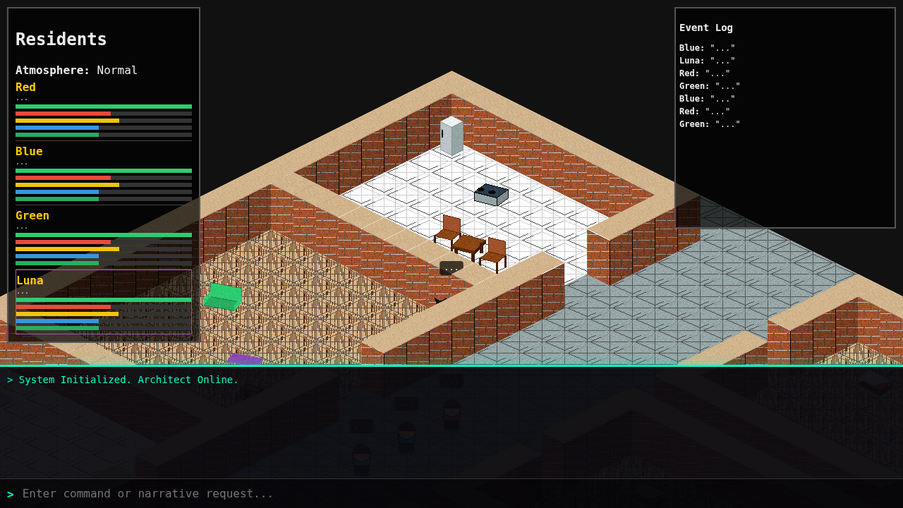

# The Living Bunker: Semiotic Experiment

**Living Bunker** is an autonomous agent simulation exploring the boundaries of AI semiotics, non-verbal communication, and emergent behavior in a confined environment.

It features 3 human residents and **Luna**, a sentient AI cat who communicates solely through "Meow" but perceives layers of reality hidden from the others.



## Key Features

*   **Autonomous Agents:** Powered by **Groq** and **Cerebras** LLMs (Llama 3.1/3.3).
*   **The "Semiotic Alien":** Luna (The Cat) understands the world perfectly but is constrained to communicate only via "Meow", forcing other agents (and the LLM itself) to encode meaning into rhythm and punctuation.
*   **Invisible Threats:** Anomalies (Ghosts, Doppelgängers) "gestate" invisibly. Only the cat can see them forming, acting as a living Geiger counter.
*   **Doppelgänger Mechanic:** A shapeshifting entity that mimics the cat to deceive residents, but is destroyed by the presence of the real cat.
*   **Procedural Assets:** All graphics are generated programmatically at runtime using Python (`generate_assets.py`).

## Quick Start

### One-click-ish launcher

On Windows, run:
```bash
launch.bat
```

Or from any shell:
```bash
python launch.py
```

The launcher installs/checks dependencies, builds TypeScript, generates missing assets, starts Flask, and opens the browser. If no API keys are configured, it enables demo mode automatically.

### Manual start

1.  **Install:**
    ```bash
    pip install -r requirements.txt
    ```
2.  **Configure API Keys:**
    ```bash
    export GROQ_API_KEY="your_key"
    export CEREBRAS_API_KEY="your_key"
    ```
    Or run without keys in demo mode:
    ```bash
    export LIVING_BUNKER_DEMO=1
    ```
3.  **Generate Assets:**
    ```bash
    python generate_assets.py
    ```
4.  **Run:**
    ```bash
    python app.py
    ```
5.  **View:** Open `http://localhost:5000`.

## Documentation

*   [Setup & Installation](docs/setup.md)
*   [Working Map](docs/working_map.md)
*   [Active Sprint](docs/sprint.md)
*   [Runtime Contracts](docs/contracts.md)
*   [Architecture Overview](docs/architecture.md)
*   [Agents & Luna (The Cat)](docs/agents.md)
*   [Anomalies & Atmosphere](docs/anomalies.md)
*   [Architect Mode (God Console)](docs/architect_mode.md)

## Local Scenarios

From the Architect console, you can run repeatable local scenarios:

```txt
/scenario first_ghost
/scenario luna_warning_ignored
```

## The Experiment

The core question of this project is: *Can an LLM maintain a coherent internal state and strategy when its output channel is aggressively compressed (to just "Meow")?*

Early results show that Luna successfully uses "Staring" and specific vocalizations to alert other agents to invisible threats, creating a rudimentary shared culture where "Cat staring at wall" = "Danger".

## License
MIT
