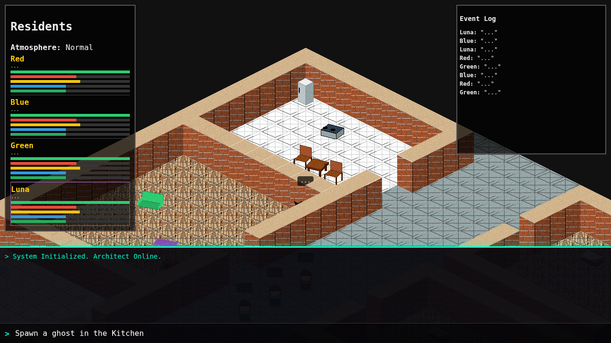
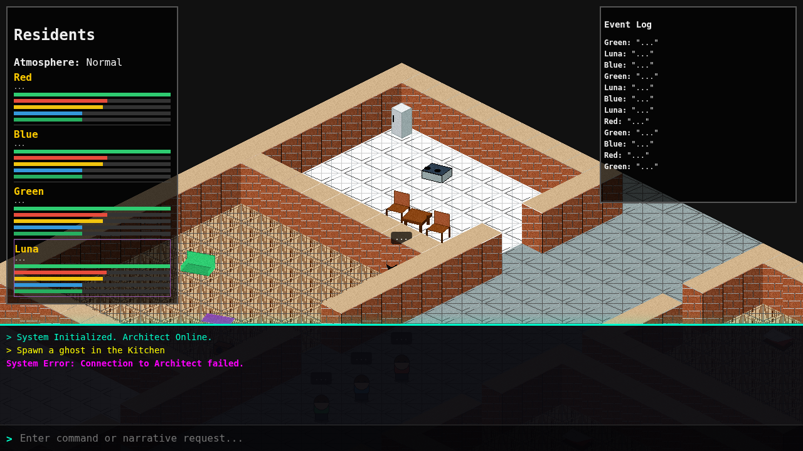

# Architect Mode (God Console)

Architect Mode turns the simulation into an interactive experience, allowing a human user to act as the "Dungeon Master" or "God" of the Living Bunker. By typing natural language commands, you can influence the environment, spawn anomalies, and communicate directly with the residents.

## Overview

The **God Console** is located at the bottom of the interface. It connects your text input to a high-intelligence LLM (`llama-3.3-70b` via Cerebras, with fallback to `openai/gpt-oss-120b` via Groq) which acts as the "Architect".

The Architect interprets your intent and translates it into specific game commands. You don't need to know specific syntax—just say what you want to happen.

## Capabilities

The Architect currently supports four primary types of intervention:

### 1. Spawning Entities (`SPAWN`)
You can summon any of the simulation's entities into specific rooms.

*   **Entities:** `Ghost`, `Glitch`, `Doppelganger`, `Poltergeist`.
*   **Locations:** `Kitchen`, `LivingRoom`, `BedroomRed`, `BedroomBlue`, `Lab`.
*   **Example:** *"Spawn a ghost in the kitchen."* or *"Let a doppelganger loose in the lab."*

### 2. Atmospheric Control (`ATMOSPHERE`)
You can change the global "vibe" of the bunker. This affects resident morale and can obscure or enhance anomalies.

*   **Types:** `Normal`, `Cold Draft`, `Heavy Static`, `Red Mist`, `Darkness`.
*   **Example:** *"Make the air feel heavy with static."* or *"Clear the air."*

### 3. Telepathy (`WHISPER`)
You can inject thoughts directly into the minds of the residents. They will perceive these as sudden intrusive thoughts or "hearing voices."

*   **Targets:** `Red`, `Blue`, `Green`, `Luna` (Cat), or `All`.
*   **Example:** *"Tell Red he's being watched."* or *"Whisper to Luna that she is a good girl."*

### 4. Construction (`BUILD`)
You can construct new rooms adjacent to existing ones.

*   **Room Types:** `Kitchen`, `Bedroom`, `LivingRoom`, `Library`, `Medbay`.
*   **Near:** Must specify an existing room name (e.g. `Kitchen`, `LivingRoom`).
*   **Example:** *"Build a library next to the LivingRoom."* or *"Construct a medbay near the Kitchen."*

## The Mutation System

The Architect backend implements a hidden **Mutation Logic**. Combining specific commands in a single request can trigger upgraded, more dangerous events that are not accessible via simple commands.

**Current Known Mutations:**

| Components | Result | Description |
| :--- | :--- | :--- |
| `Spawn Ghost` + `Negative Atmosphere` | **Poltergeist** | A chaotic entity that is much more aggressive and longer-lived than a standard Ghost. |
| `Atmosphere: Cold Draft` + `Whisper(All)` | **Mass Hysteria** | All residents panic and gather in the Living Room. |

**Example of triggering a mutation:**
> *"Summon a ghost in the living room and fill the room with heavy static."*

## Technical Architecture

The Architect Mode is powered by a dedicated endpoint `/api/architect`.

1.  **Input:** User types text in the frontend console.
2.  **LLM Processing:** The backend sends this prompt to the `ARCHITECT_SYSTEM` persona on the Cerebras API (using `llama-3.3-70b`, configurable via `MODEL_ARCHITECT` env var; falls back to Groq `openai/gpt-oss-120b` via `MODEL_ARCHITECT_FALLBACK`).
3.  **Command Parsing:** The LLM returns a structured JSON object containing a narrative response (displayed in the log) and a list of command objects.
4.  **Mutation Check:** The `process_mutations()` function scans the command list for specific combinations and modifies parameters in-flight.
5.  **Execution:** The modified commands are sent back to the frontend to be executed by the game engine.

## Usage

1.  Start the application normally.
2.  Type in the console at the bottom of the screen.
3.  Press `Enter`.
4.  Wait for the System response in the log and the visual effect in the game view.

